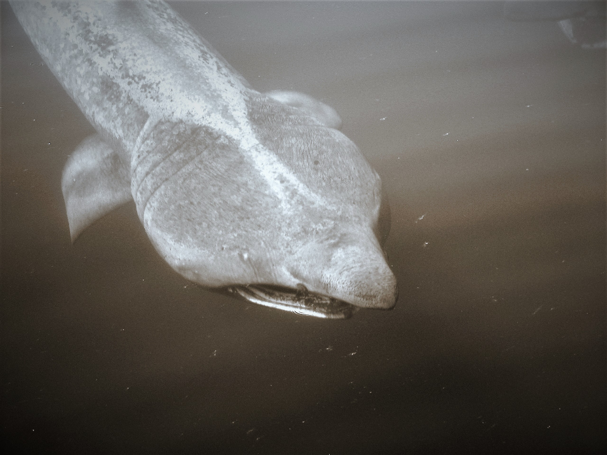

# Basking Sharks #
---
## Where to spot them in West Scotland ##

Photo by Jason Muteham
 
---

[**Hebridean Whale and Dolphin Trust**](https://www.hwdt.org)

Based on the Isle of Mull, in the heart of the Hebrides, HWDT has been leading the way for the conservation of whales, dolphins and porpoises in the waters of western Scotland for over two decades.

We believe evidence is the foundation of effective conservation. Our research has critically advanced the understanding of species that visit seasonally or are resident in the Hebrides. Data are provided to the Scottish Government to inform protection measures for minke whales, Risso’s dolphins, harbour porpoises, and basking sharks across Hebridean seas.

---

Questions answered in this report 

- How many Basking sharks have been observed by the Hebridean Whale and Dolphin Trust?
- Where is the best location to see Basking sharks?

This notebook analyses the wrangled data created in the notebook [HWDT Data Wrangle.ipynb](/HWDT%20Data%20Wrangle.ipynb)

--- 

Data provided by the following providers: 

<ul><li>Records provided by Hebridean Whale and Dolphin Trust, accessed through NBN Atlas website. (2022). For more information: email info@hwdt.org, or https://registry.nbnatlas.org/public/show/dp81</li><li>Hebridean Whale and Dolphin Trust (2022). Visual sightings data set 2003-2021. Occurrence dataset on the NBN Atlas (Creative Commons, with Attribution, Non-commercial v4.0 (CC-BY-NC) CC-BY-NC). For more information: email biodiversityofficer@hwdt.org, or https://registry.nbnatlas.org/public/show/dr537</li></ul>

---